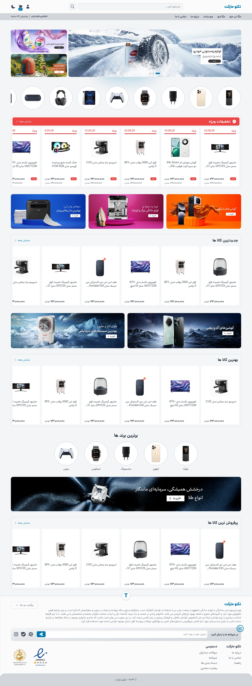
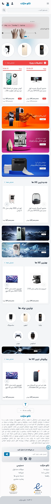
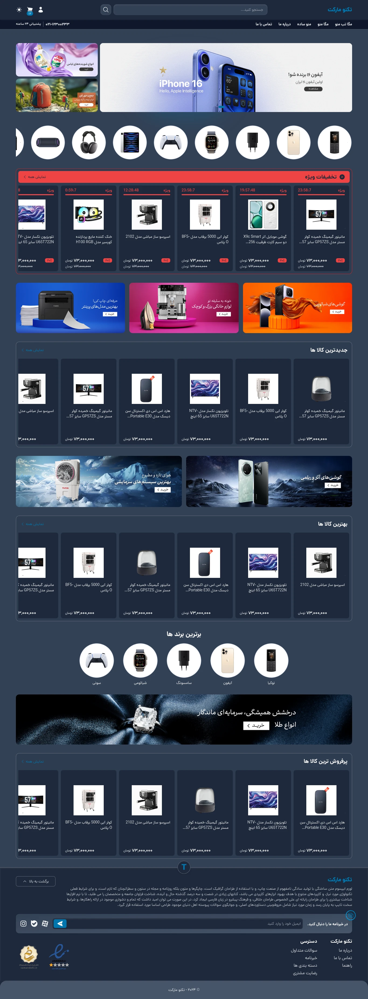
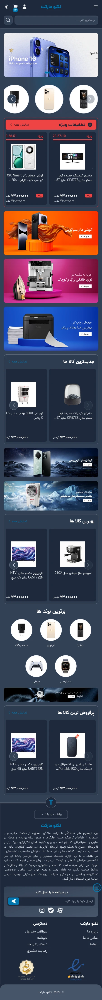

# 🛒 TechnoMarket

A modern, responsive **RTL technology shop template** built with **HTML, Tailwind CSS, JavaScript, jQuery, and Swiper.js**.

TechnoMarket is a Persian-first e-commerce UI template designed for technology stores, featuring a responsive layout, dark/light mode, product navigation, search interface, shopping cart UI, mega menus, and mobile navigation.

> 🚧 **Project Status:** Frontend template / UI project

---

## 🌐 Language

🇬🇧 **English** | 🇮🇷 [فارسی](README_FA.md)

---

## 📸 Preview

<div align="center">









</div>

---

## ✨ Features

* 🛒 Technology e-commerce UI
* 🇮🇷 Persian / RTL-first interface
* 📱 Responsive design
* 🌙 Dark / Light mode
* 🔎 Search interface
* 🧭 Responsive navigation
* 📂 Mega menu navigation
* 🛍️ Shopping cart UI
* 👤 Account / user panel UI
* 📱 Mobile navigation drawer
* 🎠 Product sliders
* 📦 Product category navigation
* 🖥️ Desktop and mobile layouts
* 🎨 Tailwind CSS utility-based styling
* ⚡ Lightweight frontend architecture

---

## 🛠️ Tech Stack

| Technology      | Purpose                 |
| --------------- | ----------------------- |
| HTML5           | Page structure          |
| CSS3            | Custom styling          |
| Tailwind CSS    | Utility-first styling   |
| JavaScript      | Interactions            |
| jQuery          | DOM and UI interactions |
| Swiper.js       | Sliders and carousels   |
| Fontiran / Dana | Persian typography      |

The repository's project notes identify HTML, CSS, JavaScript, jQuery, and Tailwind CSS as the main technologies.

---

## 📂 Project Structure

```text
TechnoMarket/
│
├── assets/
│   ├── css/
│   ├── font/
│   ├── image/
│   │   ├── base/
│   │   └── home/
│   └── js/
│
├── views/
│   ├── base.html
│   └── index.html
│
├── about.txt
├── package.json
├── tailwind.config.js
└── tailwind.test.js
```

The current repository is organized around reusable base assets and view templates, with separate image resources for the base layout and homepage.

---

## 🏠 Homepage

The homepage provides a complete technology-store interface including:

* Header
* Search bar
* Search result interface
* Account button
* Shopping cart
* Dark / Light mode toggle
* Desktop navigation
* Mega menu
* Mobile navigation
* Product categories
* Promotional sections
* Product sections
* Footer

The main page is implemented in `views/index.html`.

---

## 🔎 Search UI

TechnoMarket includes a search interface with:

* Search input
* Search button
* Category results
* Product results
* Search suggestions
* Responsive layout

The current implementation is a frontend UI and does not include a backend search service.

---

## 📂 Mega Menu

The desktop navigation includes a multi-level mega menu designed for technology categories.

Current categories include examples such as:

* 📱 Mobile
* 💻 Laptop
* 📚 Books

The mobile category also contains example brands and products such as Samsung, Xiaomi, Poco, and Redmi.

---

## 🌙 Dark Mode

The interface supports both:

* ☀️ Light Mode
* 🌙 Dark Mode

The theme switch is integrated into the main header and uses Tailwind's dark-mode utility classes.

---

## 📱 Responsive Design

The layout is designed for multiple screen sizes.

Desktop users receive a full navigation and mega menu experience, while smaller screens use a mobile navigation interface.

---

## 🚀 Getting Started

Clone the repository:

```bash
git clone https://github.com/ArshiaGalaxy/TechnoMarket.git
cd TechnoMarket
```

The project uses a simple frontend setup and does not currently require a backend server.

---

## 🎨 Tailwind CSS

The project includes Tailwind CSS configuration and a development script for generating the Tailwind stylesheet.

Install the required dependencies:

```bash
npm install
```

Then run the CSS watcher:

```bash
npm run run_css
```

> **Note:** The current `package.json` defines the CSS development command as `run_css`.

---

## 🧩 Architecture

TechnoMarket uses a lightweight template-based frontend structure:

```text
Base Layout
     │
     ▼
  Header
     │
     ├── Search
     ├── Account
     ├── Cart
     └── Theme Toggle
     │
     ▼
 Navigation
     │
     └── Mega Menu
     │
     ▼
 Homepage
     │
     ├── Categories
     ├── Products
     ├── Promotions
     └── Content Sections
     │
     ▼
 Footer
```

---

## ⚠️ Current Limitations

TechnoMarket is currently a **frontend template**, not a complete e-commerce application.

The current repository does not include:

* Backend API
* Database
* Authentication system
* Real payment processing
* Persistent shopping cart
* Real product management
* Order management
* Server-side search

Some links and interactions are UI placeholders intended for future development.

---

## 🗺️ Roadmap

* [ ] Add backend API
* [ ] Add product database
* [ ] Add real authentication
* [ ] Add product details pages
* [ ] Add shopping cart functionality
* [ ] Add checkout
* [ ] Add order management
* [ ] Add product filtering
* [ ] Add real search
* [ ] Add user dashboard
* [ ] Add wishlist
* [ ] Add responsive product pages
* [ ] Improve accessibility
* [ ] Add SEO metadata
* [ ] Improve performance
* [ ] Add automated testing

---

## 🤝 Contributing

Contributions, suggestions, UI improvements, and bug reports are welcome.

```bash
git checkout -b feature/my-feature
```

Make your changes, test them, and commit:

```bash
git add .
git commit -m "Add my feature"
git push origin feature/my-feature
```

Then open a Pull Request.

---

## 📄 License

The repository currently specifies the **ISC License** in `package.json`.

---

## 🌐 Language

🇬🇧 **English** | 🇮🇷 [فارسی](README_FA.md)
